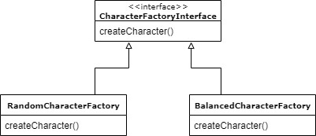
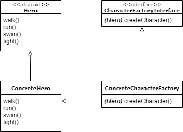

[&laquo; back to index](../../README.md)
# Factory Method Pattern
## Enter "Factory Method Pattern"

Why do we need the factory pattern? How can it help us?

In the article about the **strategy pattern** we saw how it is possible to program in an "illusory" way (through the so-called "wishful thinking"), imagining that we have the necessary objects available and passing them wherever they should be used, through the mechanism by dependency injection.

However, it is evident that, at some point in the program, sooner or later, such objects must inevitably be instantiated.

This is where the factory pattern comes in: whenever you are in the condition of having to create an object, you can encapsulate this procedure in a piece of code that becomes responsible for the creation of that object (single responsibility).

Of course, it may seem pointless to create a wraper around the "new" keyword, which would result in replacing one line of code with another, but let's consider the following:
1. The object can also be very complex and require particular configurations, perhaps dependent on the context, so the creation itself could depend on a potentially complex logic
1. Thinking about the practice of dependency injection, it is clear that each object could depend on the creation of other objects (even at multiple levels): this approach allows us not to worry about the entire chain, as each object will have its own factory, which will take care of instantiating, through other factories, what is needed
1. This practice allows you to introduce and take advantage from polymorphism: if the factory is an instance of something, we can change this instance, even at runtime, with another class instance that implements the same interface, but has different behaviors

It is this last point that differentiates the "Factory Method" from the "Simple Factory", introducing a slightly higher level of abstraction.  

The point is: based on the scenario and what is being built, there could be more logics that determine what is to be created and how, and these logics can be encapsulated in what are commonly called "Factory", responsible for the entire process of creating our objects.

Different factories can create our objects in different ways (i.e. according to different logics), or they can create different subtypes

The Factory pattern therefore clearly divides two different concepts:
- What is created
- What it has the task of creating

Generalizing, we can schematize this architecture as follows:

The "ConcreteCharacterFactory" has therefore the task of creating objects of type "ConcreteHero", or other extensions of "Hero", and how to do it is completely its responsibility.
Likewise, other implementations of the "CharacterFactoryInterface" can create the same objects, in completely different ways.

[next - Some code &raquo;](04_exampleCode.md)
