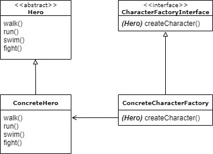

[&laquo; torna all'indice](../../README.md)
# Factory Method Pattern
## Entra in scena il "Factory Method Pattern"

Perché ci serve il factory pattern? In che modo può esserci utile?

Nell'articolo relativo allo **strategy pattern** abbiamo visto come sia possibile programmare in modo "illusorio" (mediante il cosiddetto "wishful thinking"), immaginando di avere a disposizione gli oggetti necessari e passandoli ovunque debbano essere utilizzati, tramite il meccanismo di dependency injection.

È però evidente che, in qualche punto del programma, prima o poi, tali oggetti debbano inevitabilmente essere istanziati.

È qui che entra in gioco il factory pattern: ogni volta che ci si trova nella condizione di dover creare un oggetto, è possibile incapsulare questa procedura in un punto del codice che diventa responsabile della creazione di quell'oggetto (single responsibility).

Naturalmente, può sembrare inutile creare un wrapper intorno alla keyword "new", cosa che si tradurrebbe nel sostituire una riga di codice con un'altra, ma proviamo a considerare quanto segue:
1. L'oggetto può anche essere molto complesso e necessitare di particolari configurazioni, magari dipendenti dal contesto, per cui la creazione stessa potrebbe dipendere da una logica potenzialmente complessa
1. Pensando alla pratica della dependency injection, appare evidente che ogni oggetto potrebbe dipendere dalla creazione di altri oggetti (anche a più livelli): questo approccio ci permette di non preoccuparci dell'intera catena, in quanto ogni oggetto avrà il proprio factory, che si occuperà di istanziare, tramite altri factories, quanto necessario
1. Questa pratica permette di introdurre e sfruttare il polimorfismo: se il factory è un'istanza di qualcosa, possiamo cambiare questa istanza, anche a runtime, con un'altra istanza di classe che implementi la stessa interfaccia, ma abbia comportamenti diversi
  
È proprio quest'ultimo punto a differenziare il "Factory Method" dal "Simple Factory", introducendo un livello di astrazione appena superiore.  

Il punto cruciale del discorso è: in base allo scenario ed a ciò che si sta costruendo, potrebbero esserci più logiche che determinino cosa debba essere creato e come, e queste logiche sono incapsulabili in quelli che comunemente vengono definiti "Factory", responsabili dell'intero processo di creazione dei nostri oggetti.

Differenti factories possono creare i nostri oggetti in modi diversi (ovvero secondo diverse logiche), oppure possono creare differenti sottotipi

Il Factory pattern divide quindi nettamente due diversi concetti:
- Ciò che viene creato
- Ciò che ha il compito di creare

Generalizzando, possiamo schematizzare tale architettura come segue:

Il "ConcreteCharacterFactory" ha quindi il compito di creare oggetti di tipo "ConcreteHero", o altre declinazioni di "Hero", ed il modo in cui farlo è completamente una sua responsabilità.
Allo stesso modo, altre implementazioni della "CharacterFactoryInterface" possono creare gli stessi oggetti, in modi completamente diversi.

[successivo - Un po' di codice &raquo;](04_exampleCode.md)
